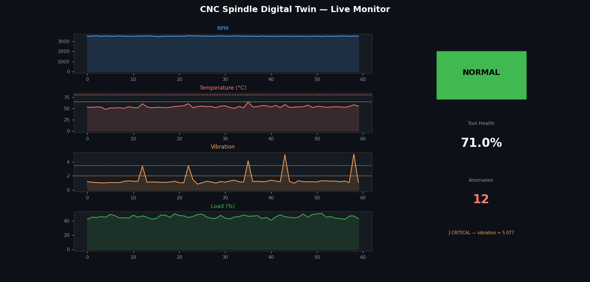

# CNC Spindle Digital Twin

A real-time digital twin simulation of a CNC machine spindle, built in Python.
Monitors spindle health live and detects anomalies using threshold-based logic.



## What it does

- Simulates a CNC spindle streaming live sensor data (RPM, temperature, vibration, load)
- A DigitalTwin class receives data and tracks machine state in real time
- Detects anomalies and classifies severity as WARNING or CRITICAL
- Live matplotlib dashboard updates every 500ms with 4 sensor charts
- Tracks tool wear % and predicts remaining tool life

## Tech stack

- Python 3.x
- NumPy: sensor data simulation with realistic noise
- Matplotlib: live animating dashboard

## How to run

```bash
pip install -r requirements.txt
python spindle_twin.py
```

## What I learned

Built during a 70-minute train journey as a self-directed project.
Covers core digital twin concepts: sensor simulation, state machines,
anomaly detection, and real-time data visualization the same architecture
used in industrial platforms like Siemens MindSphere and Azure Digital Twins.

## Author
Amalkrishna, Intelligent Manufacturing student interested in Industry 4.0,
digital manufacturing, and CAM simulation.